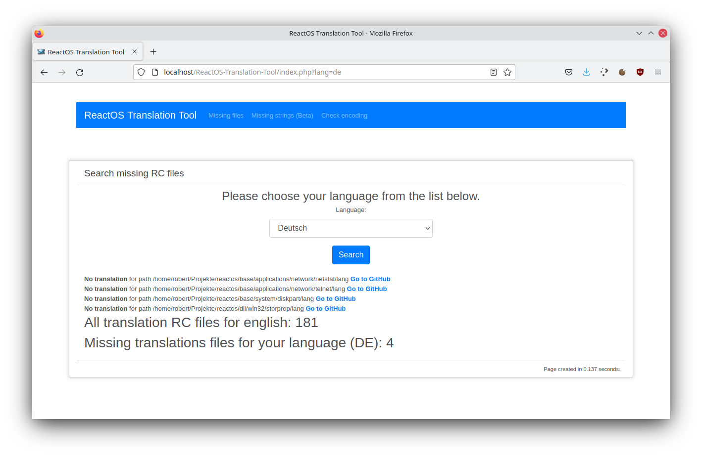
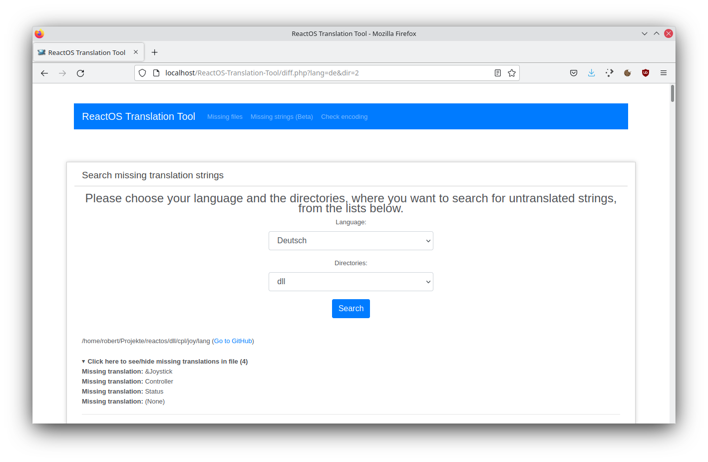
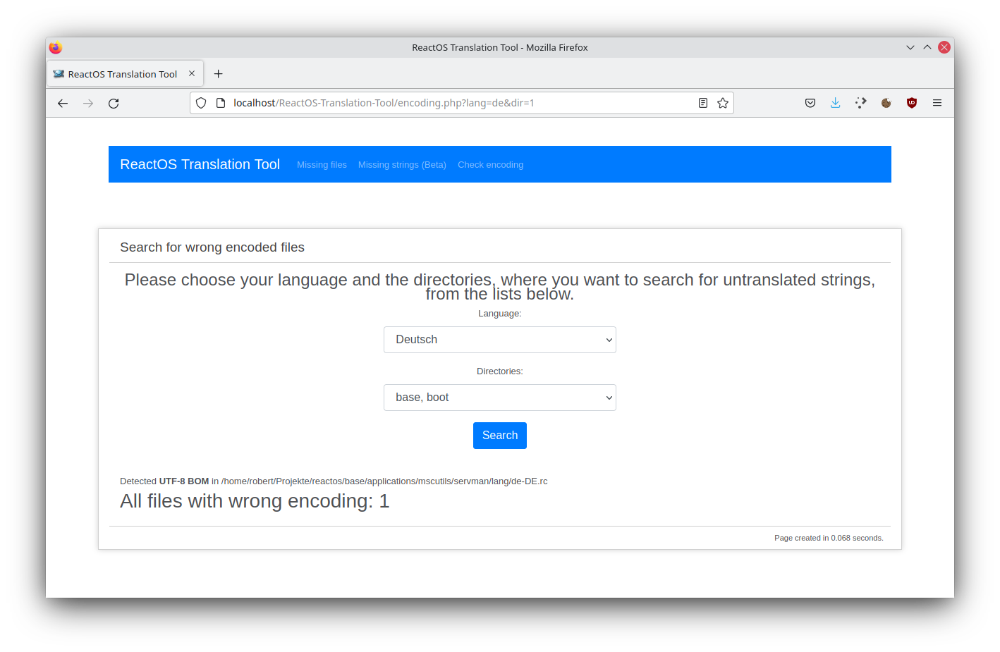

[](https://scrutinizer-ci.com/g/Saibamen/ReactOS-Translation-Tool/?branch=master)
[](https://codeclimate.com/github/Saibamen/ReactOS-Translation-Tool/maintainability)
[](https://styleci.io/repos/39967290)
[](https://insight.sensiolabs.com/projects/07387aac-72c8-460e-9aa8-d249c7a6a433)

# ReactOS Translation Tool

## Overview

ReactOS Translation Tool is a little web-application which helps you to find missing or incomplete translations, as well as wrongly encoded RC-files within the ReactOS operating system.

## Features

* ### Find missing translation RC files
  
* ### Find missing translation strings (**WIP**)
  
* ### Find wrong encoded files
  

Additionally the tool offers you a direct link to ReactOS' Github repository to find the correct place to add the missing translation.

## Installation

To use ReactOS Translation Tool, you need a web accessible directory on a server, a hosting platform or on your local PC (e.g. XAMPP).
Additionally you also need the ReactOS sourcecode on this server. Now follow the following steps:

* upload the files from this repo to your web directory and edit the `config.php` file
* change the following line according to the path where your ReactOS source code is:

```php
      // ReactOS Source directory - must contain the base and dll directories
      $ROSDir = '/home/you/your/source/directory/';
```
* test it! If everything went well you will get a similar experience like on the screenshots above


## TODO / Known Bugs

* Fix pattern in diff.php to catch multiline strings with ""some text"" (part 1/2 - FIXED?)

## Contact

Homepage: https://reactos.org/

Author: [Adam Stachowicz](https://github.com/Saibamen) <saibamenppl@gmail.com> (http://it-maniak.pl/)
